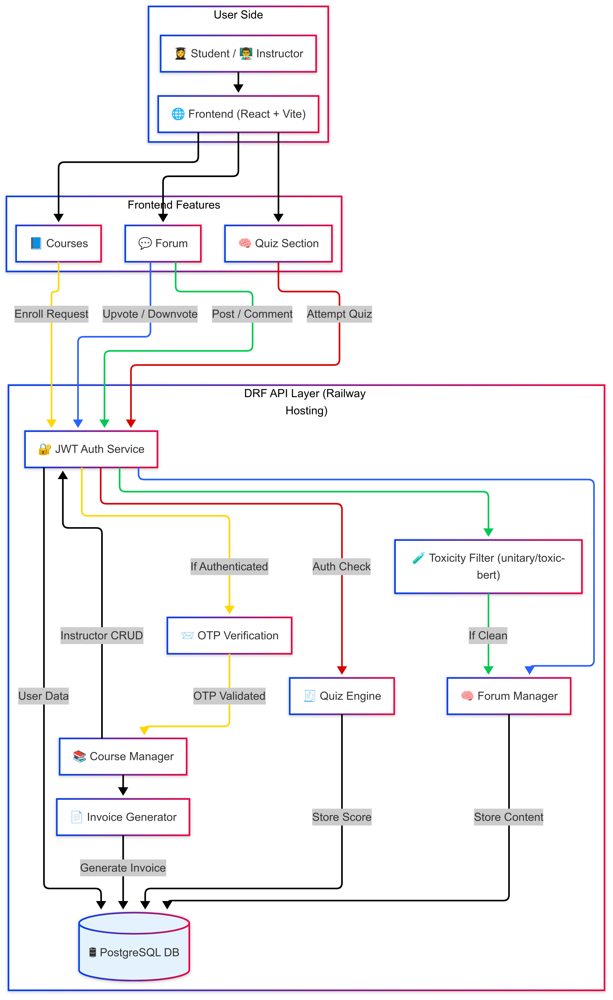
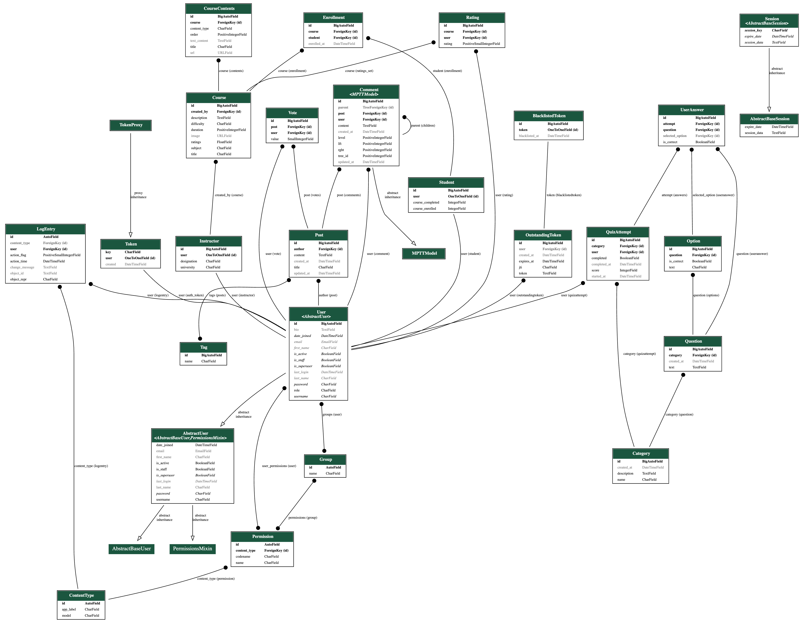

<div align ="center">

</div>

**Transforming Education with Seamless Learning**

KUETx is a full-stack Learning Management System (LMS) designed to empower educators and learners. It provides a unified platform for interactive learning and collaborative education.

---

[](https://reactjs.org)
[](https://vitejs.dev)
[](https://tailwindcss.com)
[](https://www.djangoproject.com)
[](https://www.python.org)
[](https://www.postgresql.org)
[](https://git-scm.com)
[](https://www.django-rest-framework.org)
[](https://huggingface.co)

---

<div align ="center">

## Code Quality

[](https://sonarcloud.io/summary/new_code?id=Learnathon-By-Geeky-Solutions_seagull)
[](https://sonarcloud.io/summary/new_code?id=Learnathon-By-Geeky-Solutions_seagull)
[](https://sonarcloud.io/summary/new_code?id=Learnathon-By-Geeky-Solutions_seagull)
[](https://sonarcloud.io/summary/new_code?id=Learnathon-By-Geeky-Solutions_seagull)
[](https://sonarcloud.io/summary/new_code?id=Learnathon-By-Geeky-Solutions_seagull)
[](https://sonarcloud.io/summary/new_code?id=Learnathon-By-Geeky-Solutions_seagull)

</div>

---

## 🌐 Live Demo

<p align="center">
  <a href="https://seagull-lms.netlify.app/" target="_blank">
    
  </a>
</p>

## 👨‍💻 Team

Meet the passionate developers behind **KUETx**:

| Role      | Name & GitHub Profile                               |
| --------- | --------------------------------------------------- |
| Team Lead | [Imamul Islam Ifti](https://github.com/ImamIfti056) |
| Developer | [Saif Alvi](https://github.com/yuusaif)             |
| Developer | [syed Nazib Sadi](https://github.com/SyedSadi)      |

---

### Our Guide & Mentor

A heartfelt appreciation to **[Maahad Mahmud](https://github.com/maahad767)**

---

## Features

## 📘 Course Interaction

- **Browse Available Courses**  
  Students can explore and enroll in courses based on topics, discovering relevant learning paths with ease.

- **Watch Lessons**  
  Access embedded YouTube videos for engaging, high-quality course content delivered directly in the platform.

- **Download Materials**  
  Get access to PDFs and supplementary resources for offline learning, enhancing study flexibility.

- **Attempt Quizzes**  
  Participate in course quizzes with instant feedback and scoring to reinforce learning and track progress.

- **Instructor Course Management**  
  Instructors can create, update, and delete their own courses, tailoring content to meet student needs.

- **Course Content Management**  
  Instructors can manage course materials, including lessons, PDFs, and quizzes, ensuring up-to-date and organized content.

---

## 🧠 Interactive Quizzes & Evaluation

- **Timed Quiz Sessions**  
  Students take quizzes under time constraints, simulating real test conditions.

- **Auto-Graded Scoring**  
  Quiz submissions are automatically evaluated with instant feedback.

- **Detailed Result Breakdown**  
  Students receive question-wise analysis, showing correct answers.

- **Progress Tracking**  
  Quiz performance is recorded and reflected in the student's profile

- **Re-attempts & Practice**  
  Instructors can allow multiple attempts for practice and learning reinforcement.

---

## 💬 Interactive Discussion Forum

- **Post Creation and Management**  
  Users can create, edit, and delete their own posts .

- **Toxicity Detection**  
  Posts are scanned in real-time using Hugging Face’s `unitary/toxic-bert` to prevent harmful or offensive content.

- **Tagging System**  
  Categorize posts with tags (e.g., "Python", "Django") for easy discovery and filtering of relevant topics.

- **Nested Comments**  
  Engage in threaded, hierarchical comment discussions, powered by MPTT for seamless reply chains.

- **Upvote/Downvote System**  
  Users can upvote or downvote posts to highlight quality content, with a vote score calculated as upvotes minus downvotes.

- **Post Sorting Options**  
  Filter and sort posts by tags, recent activity, or most voted all-time.

- **User Authentication**  
  Secure registration and login ensure personalized interactions with posts, comments, and votes.

---

## 📊 Dashboards & Analytics

Insightful data visualization for both learners and instructors to monitor performance and progress.

---

## 🛠️ Admin Dashboard

- **Course and Quiz Management**  
  Admins can add, edit, and remove courses and quizzes, ensuring high-quality educational content.

- **Platform Analytics**  
  View key metrics, including active users in the last 7 days, total users, students, instructors, courses, and content count, with detailed user information (names and emails).

- **Forum Moderation**  
  Admins have delete access to all forum posts, maintaining a safe and constructive community environment.

## 🔐 Secure Authentication

Modern JWT-based authentication flow for registration, login, and protected APIs.

---

## 💻 Tech Stack

### Frontend

- **React** ⚛️  
  Builds a dynamic, component-based UI for seamless course,quiz and forum interactions.
- **Tailwind CSS** 🎨  
  Powers the responsive, modern design with a teal/blue aesthetic for a vibrant user experience.

### Backend

- **Django** 🐍  
  Drives robust server-side logic for course management,quiz analysis, forum features, and secure authentication.
- **Django REST Framework** 🌐  
  Provides scalable RESTful APIs for efficient frontend-backend communication.
- **Hugging Face `unitary/toxic-bert`** 🤖  
  Enables AI-powered toxicity detection to maintain a safe and respectful forum environment.

### Infrastructure

- **PostgreSQL** 🗄️  
  Stores course, user,quiz and forum data with reliable, efficient querying.
- **ImageBB** 🖼️  
  Hosts course images for fast, reliable media delivery in learning materials.
- **CI/CD** 🚀  
  Automates testing and deployment pipelines for consistent, rapid updates.

## System Architecture

> Diagram shows how users interact through the frontend with DRF APIs for different modules including courses, quizzes, forums, and authentication.



---

## 📃API Documentation

Explore our RESTful API with interactive docs powered by drf-spectacular:

[](https://seagull-production.up.railway.app/api/schema/swagger-ui/)

## 🗂️ Entity-Relationship Diagram

Here’s an overview of the system’s data structure:



## 📂 Project Directory Structure

Here’s the directory structure of the **Seagull LMS** project:

```
seagull
├── frontend
│   ├── public
│   │   └── assets
│   ├── src
│   │   ├── assets
│   │   ├── components
│   │   │   ├── admin
│   │   │   ├── courses
│   │   │   ├── forum
│   │   │   ├── landingpage
│   │   │   ├── profile
│   │   │   ├── quiz
│   │   │   └── shared
│   │   ├── pages
│   │   ├── services
│   │   └── context
├── server
│   ├── requirements.txt
│   └── backend
│       ├── ai_utils
│       ├── course
│       ├── quiz
│       ├── forum
│       ├── user
├── README.md
├── LICENSE
└── .github
    └── workflows
```

## 🚀 Getting Started

**Clone the repository:**

```bash
git clone https://github.com/your-username/seagull.git
cd seagull
```

## 🧩 Frontend Setup

```bash
cd frontend
npm install       # install dependencies
npm run dev       # run the app at localhost
```

## 🐍 Backend Setup

```bash
cd server
python -m venv env       # create virtual environment
source env/bin/activate  # activate environment (Linux/macOS)
env\Scripts\activate     # for Windows

pip install -r requirements.txt
cd backend
python manage.py migrate
python manage.py createsuperuser  # follow prompts
python manage.py runserver
```

## 🤝 Contributing

We welcome contributions! Here's how you can help:

1. Fork this repository
2. Create a new branch: `git checkout -b feature-name`
3. Make your changes and commit: `git commit -m 'Add new feature'`
4. Push to your fork: `git push origin feature-name`
5. Submit a Pull Request

> 💡 For major changes, please open an issue first to discuss what you'd like to change.

## 📄 License

This project is licensed under the MIT License - see the [LICENSE](LICENSE) file for details.

## Acknowledgments

- Special thanks to our mentor [@maahad767](https://github.com/maahad767)
- All contributors who have helped shape this project

---

<p align="center">Made with ❤️ by Team Seagull</p>
